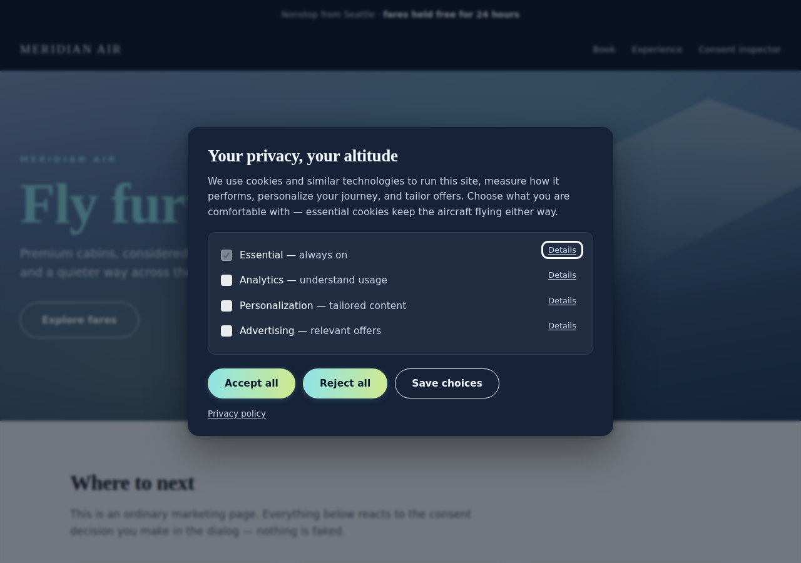

# ClearConsent

> Part of **Adobe-Analytics-DTM** — Adobe Analytics / tag management tooling.

A cookie consent manager (CMP) built for Adobe estates. It ships consent
straight into the **AEP Web SDK**, the **ECID Opt-In service**, **Adobe
Analytics**, the **Adobe Client Data Layer**, and **Adobe Launch / Tags** — with
no glue code — and it installs as a native **Launch extension** so the whole
thing lives inside the property you already publish.

**14.6 KB gzipped. One network request. Zero layout shift.**

- **Landing page** — [clearconsent-site.vercel.app](https://clearconsent-site.vercel.app) (runs the real banner on itself)
- **Interactive demo** — [clearconsent-demo.vercel.app](https://clearconsent-demo.vercel.app) (watch the Adobe calls fire live)



---

## Why another CMP

Most consent banners are generic products with an Adobe integration bolted on
afterwards. That shows up in three places.

**Weight.** A hosted CMP loads a stub, which fetches a domain config, which
fetches the real SDK — three dependent round trips before a banner can paint.
Benchmarks put OneTrust's payload around 184 KB across 16 requests. This library
is a single 14.6 KB file, and when installed as a Launch extension it is
*inlined into the Tags runtime library*, so it costs **no additional request at
all**.

**Glue code.** The standard OneTrust-plus-Adobe recipe is: override
`OptanonWrapper()`, parse `window.OnetrustActiveGroups` (a string like
`,C0001,C0002,`), hand-map those ids onto `adobe.optIn` categories, call
`approve()`/`deny()`/`complete()` yourself, then write a second mapping for
`setConsent`. Every site reinvents it, and it breaks when the vendor renames a
category. Here the mapping is configuration, and the Adobe calls are the
library's job.

**Compliance defaults.** A CHI 2020 study found only 11.8% of UK top-10k sites
using the five biggest CMPs met minimal GDPR consent requirements. An IEEE S&P
study found ~10% of TCF sites recorded consent *before the user chose*. Those
are configuration failures the products permit. This one does not permit them:
reject is always as prominent as accept, nothing is pre-ticked, and Escape is
never read as agreement.

See [docs/comparison.md](docs/comparison.md) for the full comparison with
sources.

---

## Install

### Option 1 — Adobe Launch extension (recommended)

```bash
npm install
npm run build               # produces the vendored bundle the extension requires
cd launch-extension
npx @adobe/reactor-packager # -> package-clearconsent-1.0.0.zip
npx @adobe/reactor-uploader package-clearconsent-1.0.0.zip \
  --auth.client-id=... --auth.client-secret=...
```

Then in Tags: install the extension, fill in the configuration, and publish. You
get consent events, a `Has Consent` condition, actions, and data elements
without writing any custom code. Full walkthrough:
[docs/adobe-integration.md](docs/adobe-integration.md).

### Option 2 — a script tag

```html
<script>
  window.clearConsentConfig = {
    policyVersion: 1,
    ui: { text: { privacyPolicyUrl: '/privacy' } }
  };
</script>
<script src="/assets/clearconsent.min.js"></script>
```

Or configure inline on the tag itself, which is handy when Launch hosts the file:

```html
<script src="/assets/clearconsent.min.js"
        data-clearconsent
        data-config='{"policyVersion":1,"honorGpc":true}'></script>
```

### Option 3 — npm

```bash
npm install clearconsent
```

```js
import { init } from 'clearconsent';

const consent = init({ policyVersion: 1 });
```

---

## The one API worth learning

`gate()` runs a callback as soon as a category is granted — immediately if it
already is, otherwise queued until the visitor agrees. It replaces every
"have they consented yet?" branch you would otherwise write.

```js
ClearConsent.instance.gate('analytics', () => {
  loadAnalytics();          // runs now, or the moment analytics is granted
});
```

Everything else:

```js
const consent = ClearConsent.instance;

consent.hasConsent('advertising');   // -> boolean
consent.isPending();                 // -> no explicit choice yet
consent.decision;                    // -> { essential: true, analytics: false, ... }
consent.region;                      // -> 'DE'
consent.state;                       // -> full decision record incl. method + receipt id

consent.acceptAll();
consent.rejectAll();
consent.save({ analytics: true, advertising: false });
consent.update({ advertising: true });   // merge into the current decision

consent.openPreferences();
consent.showBanner();
consent.reset();                     // clear and re-prompt

consent.on('change', ({ granted, revoked }) => { /* ... */ });
consent.getReceipts();               // client-side audit trail
```

Events are also dispatched on `document`, so nothing needs to import the
library:

```js
document.addEventListener('clearConsent:change', (e) => {
  console.log(e.detail.state.categories, e.detail.granted, e.detail.revoked);
});
```

---

## Blocking tags until consent

Mark a tag up and it stays inert until its category is granted:

```html
<!-- text/plain is not an executable type, so the browser never runs this -->
<script type="text/plain" data-cc-category="analytics" src="https://cdn.example/a.js"></script>

<!-- iframes use data-cc-src and get a click-to-enable placeholder -->
<iframe data-cc-category="personalization" data-cc-src="https://youtube.com/embed/x"></iframe>
```

A `MutationObserver` catches tags injected later — by a Launch rule, an ad
script, or a SPA route change. Blocked iframes render a placeholder with an
"Allow and show" button rather than collapsing to an empty box, which is the
usual complaint about auto-blocking CMPs breaking embeds.

---

## Configuration

```js
{
  policyVersion: 1,            // bump to invalidate every stored decision
  model: 'opt_in',             // fallback when no region rule matches
  reconsentDays: 365,          // CNIL suggests ~6 months as good practice

  categories: [ /* defaults: essential, analytics, personalization, advertising */ ],

  regions: [                   // defaults cover EEA/UK/CH/BR (opt-in) and US/CA (opt-out)
    { match: ['DE', 'FR'], model: 'opt_in' },
    { match: ['US-CA'], model: 'opt_out', defaultGranted: ['essential', 'analytics'] },
    { match: ['*'], model: 'opt_in' }
  ],

  geo: {
    region: 'DE',              // force one, or…
    metaTagName: 'x-geo',      // …read a CDN header echoed into a meta tag (free), or…
    endpoint: '/api/geo'       // …look it up (never blocks first paint)
  },

  honorGpc: true,              // Global Privacy Control — binding under CPRA/Colorado
  honorDnt: false,             // legacy, no legal force
  autoBlock: true,

  storage: {
    cookieName: 'clearconsent',
    cookieDomain: '.example.com',   // share across subdomains
    expiryDays: 365
  },

  ui: {
    layout: 'modal',           // 'modal' | 'bar' | 'box'
    position: 'center',
    blocking: true,
    showBadge: true,
    headless: false,           // run the engine, draw your own dialog
    theme: { surface: '#1b1530', accent: 'linear-gradient(96deg,#7d8bff,#b57cff)' },
    text: { title: '…', body: '…', privacyPolicyUrl: '/privacy' }
  },

  adobe: {
    mapping: {
      collect: ['analytics', 'personalization', 'advertising'],
      share: ['advertising'],
      personalize: ['personalization'],
      analytics: ['analytics'],
      target: ['personalization'],
      audienceManager: ['advertising']
    }
  },

  receipt: { enabled: true, endpoint: '/api/consent-receipts', historySize: 10 }
}
```

---

## What it does on your behalf

| Adobe surface | What happens on load and on every change |
| --- | --- |
| AEP Web SDK | `alloy("setConsent", …)` with the Adobe 2.0 standard, on every discovered instance |
| ECID Opt-In | `approve()` + `deny()` staged, then a single `complete()` |
| AppMeasurement | sets `s.abort` and `s.optOut`, catching hardcoded `s.t()` outside Tags |
| Client Data Layer | pushes a `consent-updated` event with the resolved Adobe purposes |
| Launch | fires the `clear-consent-changed` direct call rule |

Each adapter feature-detects its target and does nothing when that product is
absent, so leaving all five on is safe.

---

## Compliance posture

These are behaviors, not settings:

- **Nothing is pre-ticked** in an opt-in region (CJEU *Planet49*, C-673/17).
- **Reject is as prominent as accept** — same size, same styling, first layer.
  The CNIL fines against Google (€150M) and Meta (€60M) turned on exactly this
  asymmetry.
- **Escape and dismissal never imply consent**; in an opt-in region they record
  a rejection.
- **GPC is honored** by default — required under CPRA and the Colorado Privacy
  Act, and the basis of Sephora's $1.2M settlement.
- **Every decision writes a receipt** — id, timestamp, method, region, policy
  version, the wording shown, and a digest — kept locally and optionally POSTed
  to your endpoint.
- **The dialog is operable** — `role="dialog"`, `aria-modal`, focus trap, focus
  restoration, background marked `inert`, visible focus, reduced-motion and
  forced-colors support.

This is engineering, not legal advice. Your categories, copy, and retention
still need a lawyer's eye.

---

## Development

```bash
npm install
npm run build          # esbuild -> dist/ + the extension's vendored bundle
npm test               # 95 unit tests (vitest + jsdom)
npm run verify         # 35 checks in real Chromium against the demo
npm run demo           # http://localhost:8080/demo/index.html
npm run typecheck

# Build a genuine Adobe Tags library from the extension and run it in a browser
npm run sandbox        # leave running
npm run verify:launch  # 18 checks against real Turbine
```

The demo loads stub versions of alloy, `adobe.optIn`, AppMeasurement, the data
layer, and `_satellite`, and logs every call the consent manager makes — so you
can watch the Adobe wiring work without an Adobe account.

```
src/
  core/       engine, storage, region rules, GPC/DNT, receipts
  ui/         shadow-DOM dialog and preference center
  adobe/      Web SDK, Opt-In, AppMeasurement, data layer, Launch adapters
  blocking/   tag auto-blocker
launch-extension/   the Adobe Tags extension package
demo/               the airline demo with mocked Adobe SDKs
docs/               integration guide and comparison
```

## License

MIT
